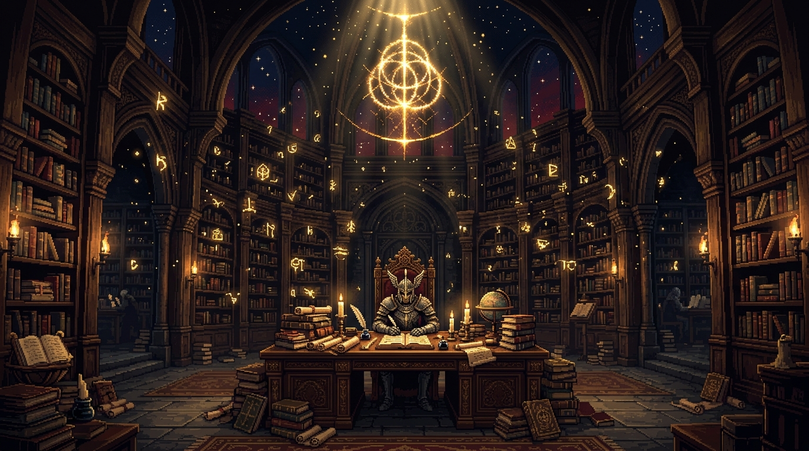
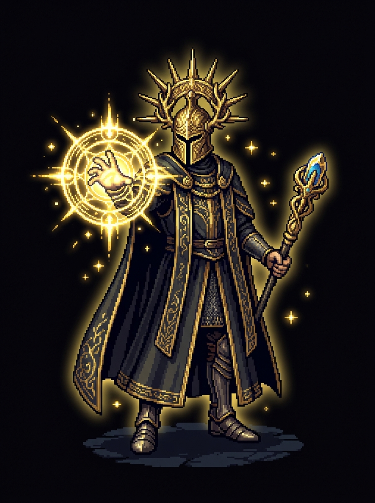
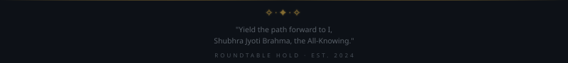

<!-- ═══════════════════════════════════════════════════════════════════════════ -->
<!--                                                                         -->
<!--   ███████╗██╗  ██╗██╗   ██╗██████╗ ██╗  ██╗██████╗  █████╗              -->
<!--   ██╔════╝██║  ██║██║   ██║██╔══██╗██║  ██║██╔══██╗██╔══██╗             -->
<!--   ███████╗███████║██║   ██║██████╔╝███████║██████╔╝███████║             -->
<!--   ╚════██║██╔══██║██║   ██║██╔══██╗██╔══██║██╔══██╗██╔══██║             -->
<!--   ███████║██║  ██║╚██████╔╝██████╔╝██║  ██║██║  ██║██║  ██║             -->
<!--   ╚══════╝╚═╝  ╚═╝ ╚═════╝ ╚═════╝ ╚═╝  ╚═╝╚═╝  ╚═╝╚═╝  ╚═╝             -->
<!--                                                                         -->
<!--       "I am the All-Knowing. And I shall render you your judgment."      -->
<!--                     — Sir Gideon Offnir, The All-Knowing                 -->
<!--                                                                         -->
<!-- ═══════════════════════════════════════════════════════════════════════════ -->

<div align="center">

<!-- Banner Image — The Roundtable Hold Library -->


<br/>

<!-- Animated Header SVG -->


<!-- Animated Rune Arc Divider -->


<!-- Gideon's Animated Quote -->


</div>

---

<div align="center">

```
⠀⠀⠀⠀⠀⠀⣀⣤⣶⣿⣿⣿⣿⣿⣶⣤⣀⠀⠀⠀⠀⠀⠀
⠀⠀⠀⣠⣶⣿⣿⣿⣿⣿⣿⣿⣿⣿⣿⣿⣿⣶⣄⠀⠀⠀
⠀⣠⣿⣿⣿⣿⣿⣿⣿⣿⣿⣿⣿⣿⣿⣿⣿⣿⣿⣄⠀
⣼⣿⣿⣿⣿⣿⣿⣿⣿⣿⣿⣿⣿⣿⣿⣿⣿⣿⣿⣿⣧
⣿⣿⣿⣿⣿⣿⣿  ALL THINGS  ⣿⣿⣿⣿⣿⣿⣿
⣿⣿⣿⣿⣿⣿⣿  CAN BE     ⣿⣿⣿⣿⣿⣿⣿
⣿⣿⣿⣿⣿⣿⣿  CONJOINED.  ⣿⣿⣿⣿⣿⣿⣿
⠻⣿⣿⣿⣿⣿⣿⣿⣿⣿⣿⣿⣿⣿⣿⣿⣿⣿⣿⣿⠟
⠀⠻⣿⣿⣿⣿⣿⣿⣿⣿⣿⣿⣿⣿⣿⣿⣿⣿⣿⠟⠀
⠀⠀⠀⠙⢿⣿⣿⣿⣿⣿⣿⣿⣿⣿⣿⣿⡿⠋⠀⠀⠀
⠀⠀⠀⠀⠀⠀⠉⠛⠿⣿⣿⣿⠿⠛⠉⠀⠀⠀⠀⠀⠀
```

</div>

## 📜 `> TARNISHED_LOG.scroll`

```js
// Roundtable Hold — Seat of the All-Knowing

const SirShubhra = {
    title:      "The All-Knowing",
    class:      "Full-Stack Developer",
    realm:      "Ahmedabad, India",
    university: "L.J. University — B.E. Computer Science (2024–2028)",
    alignment:  "Seeker of Forbidden Knowledge",
    
    philosophy: `
        "I have studied. Taken the knowledge of the many,
         and made it mine own. React, Python, Node — all fall 
         under the domain of my knowing."
    `,
    
    summon: () => "sj.brahma2006@gmail.com"
};
```

<div align="center">

| 📡 **Signal** | 🌐 **Gateway** |
|:---:|:---:|
| ✉️ sj.brahma2006@gmail.com | 🔗 [GitHub](https://github.com/Shubhra-jyoti) |
| 📞 +91 70436 44056 | 🔗 [LinkedIn](https://www.linkedin.com/in/shubhra-jyoti-brahma-8274bb3a8/) |
| 🌍 Ahmedabad, India | 🔗 [Portfolio](https://portfolio-frontend-nexus-f8af.vercel.app) |

</div>

---

<div align="center">

> *"I commend your courage, Tarnished. But I am the All-Knowing.*  
> *All that is knowable — React, Python, the very architecture of systems —*  
> *I have learned. Studied. Taken it for mine own."*  
>  
> — **Sir Gideon Offnir, The All-Knowing**

</div>

---

## ⚔️ `> SORCERIES_AND_INCANTATIONS.catalogue`

*"Do you know of the Carian sorceries? The glintstone arts of the academy? I have mastered them all."*

<div align="center">



</div>

<br/>

<div align="center">

### ⚡ Frontend Sorceries


### 🛡️ Backend Incantations


### 📜 Sacred Databases


### 🔮 Arcane Tools & DevOps


</div>

---

<div align="center">

</div>

## 🏰 `> GREAT_RUNES_ACQUIRED.manifest`

*"I have studied. Taken the knowledge of the many, and made it mine own."*  
*Each project is a Great Rune — hard-won, integrated into the Elden Ring of my knowing.*

<br/>

<table>
<tr>
<td width="50%" valign="top">

### 🌟 `SOLAR DRISHTI`
**`[ Great Rune of Foresight ]`**

> *Frontend Architect — 2026*

A real-time environmental monitoring platform.  
Translated live sensor data into navigable,  
human-readable dashboards.

*"I studied the movements of the sun and stars,*  
*and built an eye to watch them all."*

**`► STATUS: RUNE ACTIVATED`**

</td>
<td width="50%" valign="top">

### ⚡ `PRISM PLATFORM`
**`[ Great Rune of Conjuration ]`**

> *Full-Stack Developer — 2026*  
> `Next.js · React Flow · Python · Docker`

A visual drag-and-drop ML pipeline builder.  
Assemble and ship ML workflows without  
writing a single line of code.

*"All things can be conjoined."*

**`► STATUS: RUNE ACTIVATED`**

</td>
</tr>
<tr>
<td width="50%" valign="top">

### 🌍 `GLOBETROTTER`
**`[ Great Rune of the Voyager ]`**

> *Full-Stack Developer — 2026*  
> `Next.js App Router · NestJS · Tailwind CSS · Zod`

Interactive travel scrapbook & itinerary builder.  
Shared Zod schemas enforce a single source of  
truth across frontend and backend contracts.

*"I have traversed every corner of the Lands Between.*  
*Every secret, every path — known to me."*

**`► STATUS: RUNE ACTIVATED`**

</td>
<td width="50%" valign="top">

### 💎 `INNOV8 JEWELS`
**`[ Great Rune of Opulence ]`**

> *Full-Stack Developer — 2024*  
> `Next.js 14 · Supabase · Zustand`

Full-stack luxury jewelry e-commerce platform.  
Supabase for backend data and auth,  
Zustand for blazing-fast client state.

*"Even the most precious stones pale in comparison*  
*to the luster of true knowledge."*

**`► STATUS: RUNE ACTIVATED`**

</td>
</tr>
</table>

---

<div align="center">

</div>

## 📊 `> GITHUB_RUNE_STATISTICS.grimoire`

*"Knowledge begins with observation. These runes tell the tale of my conquest."*

<div align="center">

<a href="https://github.com/Shubhra-jyoti">
  
</a>
<a href="https://github.com/Shubhra-jyoti">
  
</a>

<br/><br/>

<a href="https://github.com/Shubhra-jyoti">
  
</a>

<br/><br/>

<a href="https://github.com/Shubhra-jyoti">
  
</a>

</div>

---

<div align="center">

</div>

## 🎴 `> GIDEON_DIALOGUE.memory`

<div align="center">



<br/>

```
╔══════════════════════════════════════════════════════════════╗
║                                                              ║
║   "Ahh, I knew you'd come.                                  ║
║    I am Sir Gideon Offnir, and I know... everything.         ║
║                                                              ║
║    The React component tree — I have mapped its branches.    ║
║    The Python bytecode — I have parsed its secrets.          ║
║    The NestJS dependency graph — I have traced every edge.   ║
║                                                              ║
║    All that is knowable, I have studied.                     ║
║    All that can be built, I have architected.                ║
║    All that can be deployed, I have shipped.                 ║
║                                                              ║
║    Do not test me, Tarnished.                                ║
║    For I am the All-Knowing,                                 ║
║    and I shall render you your judgment."                    ║
║                                                              ║
║                       — Sir Gideon Offnir                    ║
║                          The All-Knowing                     ║
║                                                              ║
╚══════════════════════════════════════════════════════════════╝
```

</div>

---

## 🎓 `> ACADEMY_RECORDS.archive`

```
╔═══════════════════════════════════════════════════════════╗
║  🏛️  RAYA LUCARIA ACADEMY — ACADEMIC RECORDS             ║
╠═══════════════════════════════════════════════════════════╣
║                                                           ║
║  Scholar:    Shubhra Jyoti Brahma                         ║
║  Title:      B.E., Computer Science Engineering           ║
║  Academy:    L.J. University, Ahmedabad, India            ║
║  Tenure:     The Age of Stars, 2024 – 2028                ║
║  Status:     ◈ CURRENTLY STUDYING THE ARCANE ARTS ◈       ║
║                                                           ║
║  Disciplines Mastered:                                    ║
║  ├── Full-Stack Web Development                           ║
║  ├── Data Structures & Algorithms                         ║
║  ├── Database Management Systems                          ║
║  ├── RESTful API Architecture                             ║
║  └── Modular Software Design                              ║
║                                                           ║
╚═══════════════════════════════════════════════════════════╝
```

---

<div align="center">

</div>

## 🤝 `> SOFT_SKILLS.covenant`

*"A true leader does not hoard knowledge — they share it, forge alliances, and build kingdoms."*

<div align="center">

| 🗡️ **Covenant** | 📖 **Description** |
|:---:|:---|
| 💬 **Effective Communication** | *"My words are precise — like a well-aimed Comet Azur."* |
| 🤝 **Teamwork & Collaboration** | *"Even the mightiest Tarnished cannot face the Elden Beast alone."* |
| 🏗️ **Modular Architecture** | *"I build not for today — but for the ages that follow."* |
| 🔍 **RESTful API Design** | *"Every endpoint, every contract — mapped and accounted for."* |

</div>

---

<div align="center">

### ✦ — `Y I E L D   T H E   P A T H   F O R W A R D` — ✦

```
                    ╔═══════════════════════════════════╗
                    ║                                   ║
                    ║   "Yield the path forward to I,   ║
                    ║    Shubhra Jyoti Brahma,           ║
                    ║    the All-Knowing."               ║
                    ║                                   ║
                    ║    For I have learned all that     ║
                    ║    can be learned, built all       ║
                    ║    that can be built, and          ║
                    ║    shipped all that can be         ║
                    ║    shipped.                        ║
                    ║                                   ║
                    ║    The Elden Ring of Knowledge     ║
                    ║    is mine to claim.               ║
                    ║                                   ║
                    ╚═══════════════════════════════════╝
```

</div>

---

<div align="center">

<!-- Animated Footer -->


<br/>

> *"I commend your spirit, Tarnished, but remember —*  
> *the All-Knowing watches from the Roundtable Hold. Always."*

<br/>


<br/>

⚔️ Forged at the Roundtable Hold · Powered by forbidden knowledge &amp; caffeine ⚔️

</div>

<!-- ═══════════════════════════════════════════════════════════════════════════ -->
<!--                         END OF THE ALL-KNOWING'S README                   -->
<!--  "Do you know of the Carian sorceries? I have mastered them all." — SG   -->
<!-- ═══════════════════════════════════════════════════════════════════════════ -->
